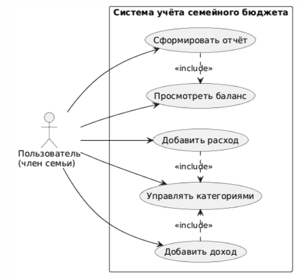
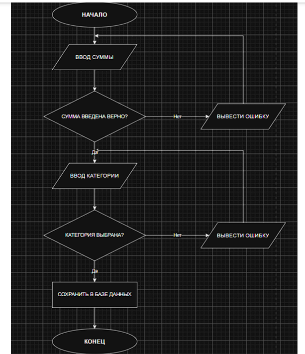
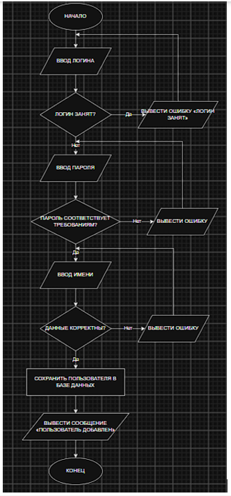

# Учёт семейного бюджета

## Лабораторная работа №2
### Документирование программных проектов: GitHub, Markdown и PlantUML

**Автор:** Грибанов Илья 
**Группа:** 26-ИВТ-2-2 
**Ссылка на репозиторий:** https://github.com/igribanov365-cell/family_budget

---

## О проекте

Программа для учёта семейного бюджета. Позволяет добавлять
доходы и расходы семьи, считать баланс и формировать отчёт.

## Функционал

- Добавление **доходов** (категория + сумма)
- Добавление **расходов** (категория + сумма)
- Подсчёт общего дохода, расхода и **баланса**
- Формирование текстового отчёта

## Пример работы

```text
Hello, first-year student!

=== Отчёт по семейному бюджету ===
Доходы:  157000.00 руб.
Расходы: 57000.00 руб.
Баланс:  100000.00 руб.
```

## Запуск

```bash
cd src/family_budget
python main.py
```

## Тестирование

```bash
pytest
```

## Структура проекта

```text
family_budget/                      # Корневая папка проекта
│
├── .git/                           # Скрытая папка Git
├── README.md                       # Описание проекта
├── .gitignore                      # Исключения Git
├── requirements.txt                # Зависимости
│
├── src/                            # Исходный код
│   └── family_budget/              # Основной пакет
│       ├── __init__.py             # Инициализация пакета
│       ├── main.py                 # Точка входа
│       └── budget.py               # Логика бюджета
│
├── tests/                          # Тесты
│   ├── __init__.py
│   └── test_budget.py
│
└── docs/                           # Документация
    └── diagrams/                   # Диаграммы PlantUML
        ├── use_case.puml
        └── use_case.png
```

## Диаграммы

### Use Case диаграмма



### Блок-схема: добавление дохода/расхода



### Блок-схема: регистрация нового члена семьи



## Технологии

- **Git** — контроль версий
- **GitHub** — хостинг
- **Markdown** — разметка
- **PlantUML** — UML-диаграммы
- **Python 3** — язык
- **pytest** — тесты